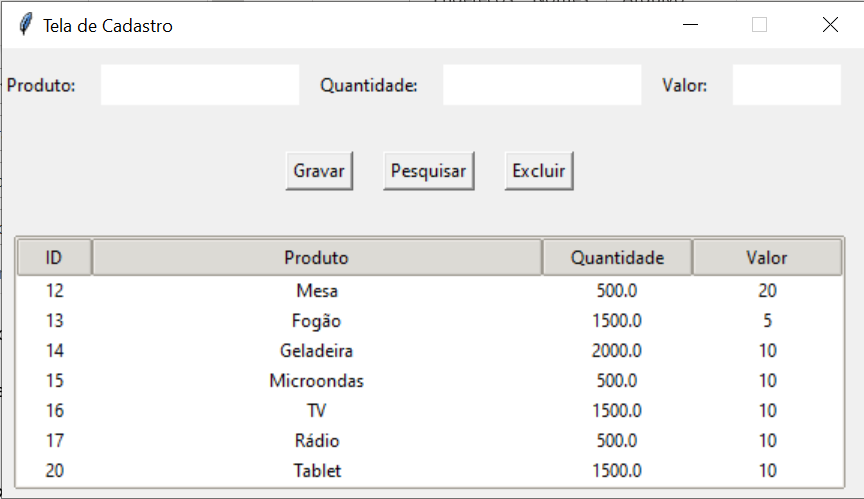

# Sistema de Cadastro utilizando SQLite e interface Tkinter

Projeto Sistema de cadastro simples, com objetivo de praticar as principais funções em banco de dados (CRUD) sendo gravação, pesquisa, atualização e exclusão de dados. 
Para este projeto foi utilizado banco de dados SQLite e interface Tkinter. 

